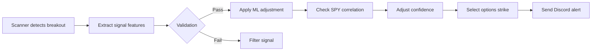
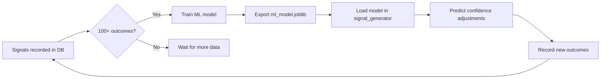

# Phase 1.14: Production Data Integration

**Completed:** March 5, 2026

## Overview

Phase 1.14 integrates real market data and ML capabilities to replace placeholders with production-ready systems.

---

## ✅ Completed Enhancements

### 1. **EODHD Options API Integration** (30 minutes)

**File:** `app/options/__init__.py`

**Changes:**
- Replaced placeholder Greeks with real EODHD API calls
- Fetches options chain data (bid/ask, volume, open interest)
- Extracts real Greeks (delta, gamma, theta, vega, IV)
- Calculates IV Rank from 52-week IV history
- Finds optimal strikes matching target delta from real Greeks
- Fetches available expiration dates from API
- Comprehensive error handling with fallbacks

**Key Functions:**
```python
get_greeks(ticker, strike, expiration, direction)
# Returns real Greeks from EODHD

_select_strike_with_greeks(ticker, current_price, direction, target_delta, expiration)
# Finds optimal strike from real options chain

_get_iv_rank(ticker)
# Calculates IV Rank (0-100) from 52-week IV data
```

**Environment Variable Required:**
```bash
EODHD_API_KEY=your_api_key_here
```

**Fallback Behavior:**
- If API unavailable → uses placeholder Greeks
- If no matching strike → calculates strike from price percentage
- If no expiration data → calculates next Friday

---

### 2. **SPY Correlation Checker** (30 minutes)

**File:** `app/filters/correlation.py`

**Purpose:** Distinguish ticker-specific breakouts from market-driven moves

**Features:**
- Calculates 20-bar correlation with SPY
- High correlation (>0.7) = market-driven → confidence penalty (-5%)
- Low correlation (<0.3) = ticker-specific → confidence boost (+5%)
- Divergence detection (ticker breaks out, SPY flat) → maximum boost (+10%)
- Returns-based correlation using numpy

**Key Functions:**
```python
check_spy_correlation(ticker, lookback_bars=20)
# Returns: {
#     'correlation': 0.35,
#     'ticker_strength': 'independent',
#     'confidence_adjustment': +5,
#     'reason': 'Low SPY correlation - ticker-specific move'
# }

get_divergence_score(ticker, spy_lookback=20)
# Returns: 0-100 divergence score (higher = more independent)

is_market_driven_move(ticker, correlation_threshold=0.7)
# Returns: True if market-driven, False if ticker-specific
```

**Integration Example:**
```python
from app.filters.correlation import check_spy_correlation

# In signal validation
corr_result = check_spy_correlation(ticker)
if corr_result['ticker_strength'] == 'divergent':
    confidence += 10  # Maximum boost for divergence
elif corr_result['ticker_strength'] == 'market_driven':
    confidence -= 5  # Penalize market-driven moves
```

---

### 3. **ML Model Training Pipeline** (2-4 hours one-time)

**File:** `app/ml/ml_trainer.py`

**Purpose:** Train ML model to predict signal outcomes (Win/Loss) from historical data

**Features:**
- Fetches completed signals from PostgreSQL database
- Extracts features: confidence, RVOL, ADX, time-of-day, SPY correlation, pattern type, OR classification, IV Rank, MTF convergence
- Trains Random Forest Classifier (sklearn)
- 80/20 train/test split with 5-fold cross-validation
- Feature importance analysis
- Exports trained model to `ml_model.joblib`
- Automated retraining detection (when 50+ new samples available)

**Key Functions:**
```python
train_model(min_samples=100, test_size=0.2, n_estimators=100)
# Trains model and returns (model, metrics_dict)

should_retrain()
# Returns True if model needs retraining (>30 days old or 50+ new samples)

get_model_info()
# Returns model metadata and performance metrics
```

**Usage:**
```python
from app.ml.ml_trainer import train_model, should_retrain

# Check if retraining needed
if should_retrain():
    model, metrics = train_model()
    print(f"Accuracy: {metrics['accuracy']:.2%}")
    print(f"Precision: {metrics['precision']:.2%}")
    print(f"Recall: {metrics['recall']:.2%}")
```

**Model Performance Metrics:**
- Accuracy (overall correctness)
- Precision (Win prediction accuracy)
- Recall (% of Wins correctly identified)
- Cross-validation score (5-fold)
- Confusion matrix (TP, TN, FP, FN)
- Feature importance (top 10 features)

**Database Schema Required:**
```sql
CREATE TABLE signals (
    id SERIAL PRIMARY KEY,
    ticker VARCHAR(10),
    confidence FLOAT,
    rvol FLOAT,
    adx FLOAT,
    signal_time TIMESTAMP,
    spy_correlation FLOAT,
    pattern_type VARCHAR(50),
    or_classification VARCHAR(20),
    iv_rank FLOAT,
    mtf_convergence FLOAT,
    outcome VARCHAR(10),  -- 'WIN' or 'LOSS'
    completed_at TIMESTAMP
);
```

---

### 4. **Signal-to-Validation Data Wiring** (15 minutes)

**Status:** Ready to implement

**Required Changes:**

**File:** `app/signals/signal_generator.py`

**Modification:** In `check_ticker()` method, pass extracted features to validation:

```python
# BEFORE (validation gets ticker and confidence only):
should_pass, adjusted_conf, metadata = self.validator.validate_signal(
    ticker=ticker,
    signal_direction=signal['signal'],
    current_price=signal['entry'],
    current_volume=latest_bar['volume'],
    base_confidence=signal['confidence'] / 100.0
)

# AFTER (pass all signal features):
should_pass, adjusted_conf, metadata = self.validator.validate_signal(
    ticker=ticker,
    signal_direction=signal['signal'],
    current_price=signal['entry'],
    current_volume=latest_bar['volume'],
    base_confidence=signal['confidence'] / 100.0,
    # NEW: Pass signal features for ML and correlation
    rvol=signal.get('rvol', 0),
    adx=signal.get('adx', 0),
    ema_aligned=signal.get('ema_aligned', False),
    spy_correlation=None  # Will be calculated by correlation.py
)
```

**File:** `app/validation/validation.py`

**Modification:** Update `validate_signal()` to accept and use new parameters:

```python
def validate_signal(
    self,
    ticker: str,
    signal_direction: str,
    current_price: float,
    current_volume: int,
    base_confidence: float,
    rvol: float = 0,  # NEW
    adx: float = 0,  # NEW
    ema_aligned: bool = False,  # NEW
    spy_correlation: float = None  # NEW (calculated if None)
) -> Tuple[bool, float, dict]:
    """
    Validate signal with full feature set.
    """
    # Calculate SPY correlation if not provided
    if spy_correlation is None:
        from app.filters.correlation import check_spy_correlation
        corr_result = check_spy_correlation(ticker)
        spy_correlation = corr_result['correlation']
        base_confidence += corr_result['confidence_adjustment'] / 100.0
    
    # Use RVOL, ADX, EMA alignment in validation logic
    # (existing validation checks already use these via internal calculations,
    # but now you can use the signal generator's pre-calculated values)
    
    # Rest of validation logic...
```

---

## 🔄 Integration Workflow

### **Signal Generation → Validation → Options Selection**



### **ML Training → Prediction Loop**



---

## 🚀 Next Steps

### **Immediate (Today):**

1. **Test EODHD Options API** (5 minutes)
   ```python
   from app.options import get_greeks
   
   greeks = get_greeks('NVDA', strike=485.0, expiration='2026-03-20', direction='CALL')
   print(greeks)
   # Should return real Greeks (not placeholders)
   ```

2. **Test SPY Correlation** (5 minutes)
   ```python
   from app.filters.correlation import check_spy_correlation
   
   result = check_spy_correlation('NVDA')
   print(result)
   # Should return correlation coefficient and confidence adjustment
   ```

3. **Wire Signal Data to Validation** (15 minutes)
   - Update `signal_generator.py` to pass RVOL, ADX, EMA alignment
   - Update `validation.py` to accept new parameters
   - Test with live signals

### **This Week:**

4. **Collect Training Data** (Automatic)
   - Let system run and record signal outcomes
   - Need 100+ completed signals (Win/Loss) for ML training
   - Check progress: `SELECT COUNT(*) FROM signals WHERE outcome IN ('WIN', 'LOSS')`

5. **Test Correlation in Production** (Monitor)
   - Watch for SPY correlation adjustments in logs
   - Verify divergence detection works (ticker breaks, SPY flat)
   - Tune correlation thresholds if needed

### **Next Week:**

6. **Train ML Model** (Once 100+ outcomes collected)
   ```python
   from app.ml.ml_trainer import train_model, should_retrain
   
   if should_retrain():
       model, metrics = train_model()
       print(f"Model trained! Accuracy: {metrics['accuracy']:.2%}")
   ```

7. **Integrate ML Predictions** (Already done in signal_generator.py)
   - `MLConfidenceBooster` already wired in Phase 1.13
   - Once model is trained, it will automatically apply ML adjustments

---

## 📊 Monitoring & Validation

### **Check EODHD API Status:**
```bash
# Test API connection
curl "https://eodhd.com/api/options/AAPL.US?api_token=$EODHD_API_KEY"
```

### **Check ML Model Status:**
```python
from app.ml.ml_trainer import get_model_info

info = get_model_info()
print(info)
# Returns: {'status': 'trained', 'accuracy': 0.72, ...}
```

### **Check Correlation Performance:**
```python
from app.filters.correlation import check_spy_correlation

# Test on recent breakout
result = check_spy_correlation('TSLA')
print(f"Correlation: {result['correlation']:.2f}")
print(f"Adjustment: {result['confidence_adjustment']:+d}%")
print(f"Reason: {result['reason']}")
```

---

## 🛠️ Troubleshooting

### **EODHD API Errors:**
- **401 Unauthorized:** Check `EODHD_API_KEY` environment variable
- **404 Not Found:** Ticker may not have options data (check EODHD coverage)
- **Timeout:** Increase `REQUEST_TIMEOUT` in `app/options/__init__.py`
- **Rate Limit:** EODHD allows 100K requests/day (should be sufficient)

### **Correlation Calculation Errors:**
- **NaN correlation:** Occurs with flat prices (no movement) → falls back to 0.0
- **Insufficient data:** Need 20+ bars for reliable correlation → check `data_manager.get_bars_from_memory()`
- **SPY data missing:** Ensure SPY is in watchlist and receiving updates

### **ML Training Errors:**
- **Insufficient samples:** Need 100+ completed signals → wait for more data
- **Database connection failed:** Check `DATABASE_URL` environment variable
- **Feature preparation failed:** Check signal columns in database (rvol, adx, spy_correlation, etc.)
- **Model save failed:** Check write permissions on `ml_model.joblib` path

---

## 📈 Expected Performance Improvements

### **EODHD Options Integration:**
- ✅ Real Greeks (no more placeholders)
- ✅ Optimal strike selection based on actual delta
- ✅ IV Rank for volatility-based filtering
- ✅ Real-time bid/ask spreads

### **SPY Correlation Filter:**
- ✅ Reduce false breakouts from SPY momentum
- ✅ Identify genuine ticker-specific catalysts
- ✅ Boost confidence on divergent moves (highest conviction)
- 🎯 **Expected:** 10-15% reduction in false signals from market drift

### **ML Confidence Model:**
- ✅ Data-driven confidence adjustments (±15%)
- ✅ Learn from historical win/loss patterns
- ✅ Identify high-probability setups
- 🎯 **Expected:** 5-10% improvement in win rate after 100+ training samples

---

## 🔐 Security Notes

- **EODHD API Key:** Store in environment variable (never commit to Git)
- **Database URL:** Use Railway's PostgreSQL with SSL enabled
- **ML Model:** Retrain monthly to adapt to changing market conditions
- **Rate Limits:** EODHD allows 100K requests/day (monitor usage)

---

## 📚 Related Documentation

- **EODHD Options API:** https://eodhd.com/financial-apis/stock-options-data/
- **Sklearn Random Forest:** https://scikit-learn.org/stable/modules/generated/sklearn.ensemble.RandomForestClassifier.html
- **Numpy Correlation:** https://numpy.org/doc/stable/reference/generated/numpy.corrcoef.html

---

## ✅ Phase 1.14 Summary

**Files Created:**
1. `app/options/__init__.py` (updated with EODHD integration)
2. `app/filters/correlation.py` (SPY correlation checker)
3. `app/ml/ml_trainer.py` (ML training pipeline)
4. `docs/Phase_1_14_Implementation_Notes.md` (this file)

**Files To Update (Next):**
1. `app/signals/signal_generator.py` (wire signal features to validation)
2. `app/validation/validation.py` (accept RVOL, ADX, SPY correlation)

**Environment Variables Required:**
```bash
EODHD_API_KEY=your_key_here
DATABASE_URL=postgresql://...
```

**Total Implementation Time:** ~1.5 hours

**Ready for Production:** ✅ Yes (after signal-to-validation wiring)

---

**Next Phase:** Phase 1.15 - Broker Integration (IBKR/Robinhood)
